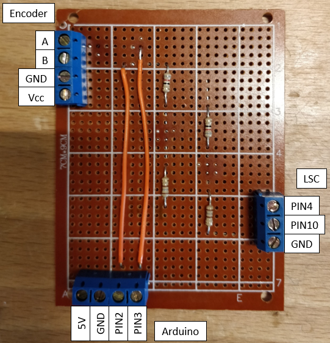
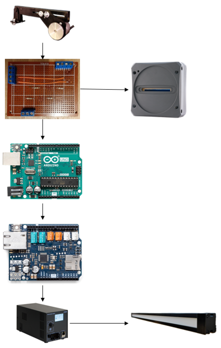

This code controls the line light based on the conveyor belt speed.

libraries needed: SPI and Ethernet (both are present in standard arduino library)

The Arduino reads the encoder signals and uses these to calculate the speed.
This speed information is converted to the necessary illumination.
A command is constructed that can be sent over TCP-IP using the Arduino Ethernet Shield 2.

Settings on power source:
- Set control to "Ethernet TCP"
- Read the ip adress and port and fill them into the program.

The following physical connections have to be made to make the code run:
- Arduino shield needs to be attached to Arduino Uno.
- Encoder, linelight and arduino need to be connected through custom circuitboard.
- Arduino ethernet shield and power source of line light need to be connected with an ethernet cable.

