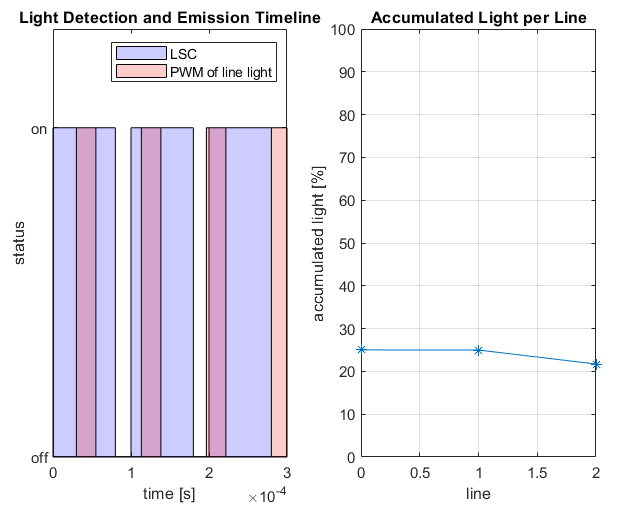

the "Control method" folder contains code that simulates two methods for controlling the brighness of a light source:
- PWM

- analog control

the "Illumination method" folder contains the two methods for controlling the exposure as presented in my thesis:
- Constant exposure and shutter speed
- dyncamic exposure and shutter speed

"Duty_cycle_explained" visualises what different duty cycles look like, this code was used to contruct an image used in my thesis.
